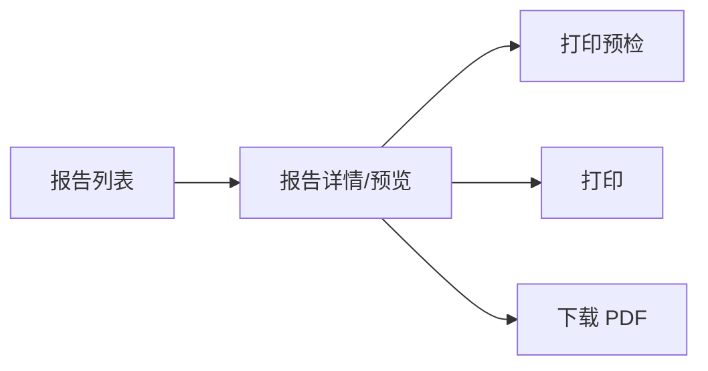
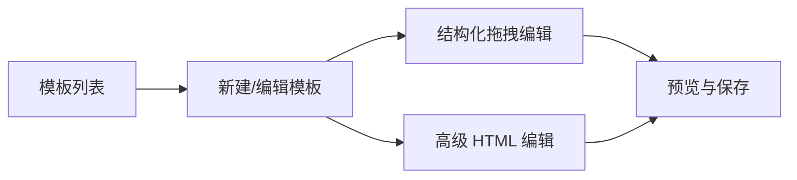
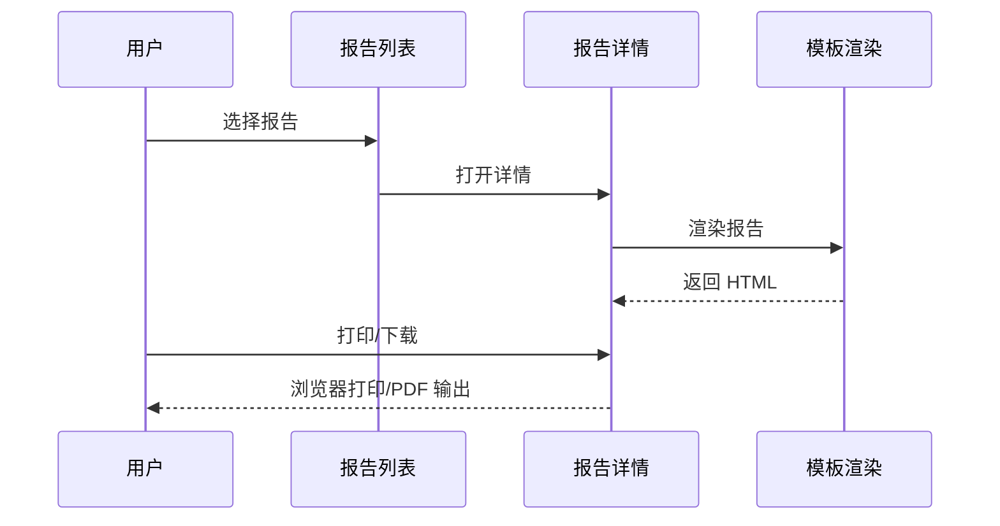
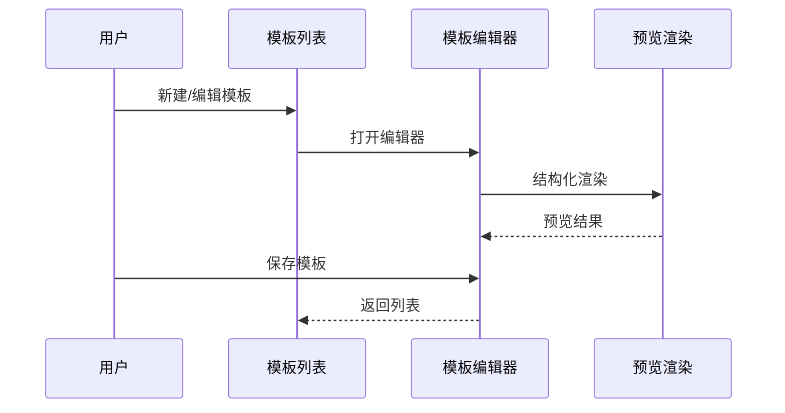

# ArkOne 报告管理系统 PRD（前端优先版）

版本: v0.5
日期: 2026-02-06
状态: Draft
负责人: Bao

## 1. 背景与目标
医疗机构与第三方实验室存在多种检验报告输出格式，导致数据对接成本高、报告样式不一致、打印体验差。

目标是提供一个标准化、可配置、可扩展的报告管理系统，先完成前端闭环，再与后端联调。

## 2. 目标用户
1. 医院检验科/信息科
2. 第三方实验室对接人员
3. 医疗机构管理者（关注标准化与监管）

## 3. 产品愿景
1. 任意来源的检验数据均可标准化渲染为一致的报告
2. 模板编辑简单可控，支持版本管理与差异对比
3. 预览、打印、PDF 输出一致

## 4. 成功指标
1. 一份标准 JSON 数据可在 3 秒内完成渲染与预览
2. PDF 输出与打印版式一致，A4 误差小于 2mm
3. 模板配置流程不超过 10 分钟即可完成首个模板

## 5. 范围与非范围
范围:
1. 报告模板渲染与预览
2. 报告打印与 PDF 下载
3. 模板管理与版本管理
4. 字段映射与标准字典配置
5. 模板编辑器（结构化拖拽 + 属性面板 + 高级 HTML）
6. 模板差异对比
7. 报告中心列表管理（预览/打印/下载）
8. 报告审核/发送状态展示

非范围:
1. 后端数据接入与存储
2. 用户认证与权限体系
3. 复杂多机构分权管理

## 6. 典型用户流程
1. 进入报告中心列表
2. 预览/打印/下载报告

模板流程:
1. 进入模板中心列表
2. 新建或编辑模板
3. 预览与保存

## 7. 功能模块与菜单
1. 报告中心
2. 模板中心
3. 数据接入
4. 标准字典
5. 系统设置
6. 帮助

## 8. 功能明细
### 8.1 报告中心
1. 报告列表（搜索、筛选）
2. 报告预览
3. 报告打印
4. 报告下载 PDF
5. 打印预检
6. 审核状态 / 发送状态展示

### 8.2 模板中心
1. 模板列表与版本信息
2. 结构化拖拽编辑
3. 属性面板编辑（样式与显示规则）
4. 高级 HTML 模式
5. 模板差异对比

模板编辑方式:
1. 结构化拖拽为主
2. 高级 HTML 为辅

结构化组件范围（v1）:
1. 页眉
2. 信息块
3. 结果表格
4. 结果卡片（综述/摘要）
5. 图片组件（Logo/示意图）
6. 文本说明
7. 条码/二维码
8. 页脚

显示规则:
1. 始终显示
2. 字段有值时显示
3. 结果存在异常标记时显示

样式设置:
1. 字体大小
2. 对齐方式
3. 内边距
4. 外边距
5. 背景色
6. 边框

### 8.3 数据接入
1. JSON 导入
2. 字段映射配置

### 8.4 标准字典
1. 检验项目字典
2. 结果标志规则

### 8.5 系统设置
1. 机构信息
2. Logo/印章配置
3. 字体配置

### 8.6 帮助
1. 模板语法说明
2. API 对接说明
3. 自测闭环说明

## 9. 数据模型（前端标准）
1. patient
2. order
3. results
4. summaryCards
5. resistanceResults
6. hivResistanceResults
7. source
8. org
9. doctor

字段示例:
1. patient.name
2. patient.gender
3. patient.age
4. patient.idNo
5. order.orderNo
6. order.sampleTime
7. order.reportTime
8. order.testDate
9. order.subtype
10. order.coverage
11. order.analysisSystem
12. order.threshold
13. order.mutationCount
14. results[].itemName
15. results[].value
16. results[].unit
17. results[].refRange
18. results[].flag
19. summaryCards[].title
20. summaryCards[].value
21. summaryCards[].iconUrl
22. resistanceResults[].category
23. resistanceResults[].latinName
24. hivResistanceResults[].geneRegion
25. org.logo

## 10. 流程图
### 10.1 报告中心流程

### 10.2 模板中心流程

## 11. 时序图
### 11.1 报告预览与打印

### 11.2 模板编辑与保存

## 12. 模板渲染规则
1. 结构化 JSON 模板 + 渲染为 HTML
2. HTML 模板可作为高级模式编辑
3. 支持列表渲染（检验结果）
4. 支持条件渲染（字段与异常标记）
5. 结果表支持 dataPath 切换（多结果数组）
6. 结果卡片支持结构化数组渲染（摘要卡片）
7. 图片组件支持字段路径或 URL
8. 支持条码/二维码

## 13. 打印与 PDF
1. 预览使用浏览器渲染
2. 打印使用 window.print()
3. PDF 下载使用 html2pdf.js
4. A4 版式适配与分页控制

## 14. 体验与视觉规范
1. 标准化产品视觉简洁稳定
2. 信息密度高但易读
3. 表格与字段对齐规范
4. 预览与打印一致性优先

## 15. 非功能需求
1. 性能: 单页渲染 < 3 秒
2. 兼容: Chrome 及 Chromium 内核浏览器
3. 安全: 前端不持久化敏感数据
4. 稳定: PDF 输出稳定，不依赖商业 SDK

## 16. 验收标准
1. 报告列表可检索、预览、打印、下载
2. 审核/发送状态展示正常
3. 模板编辑可产生新模板
4. 模板差异对比可输出结果
5. 打印版式与预览一致

## 17. 里程碑（前端）
1. 基础框架与路由搭建
2. 报告中心列表与详情完成
3. 模板中心列表与编辑完成
4. 模板编辑器增强完成
5. 模板差异对比完成
6. 打印与 PDF 验证完成

## 18. 风险与对策
1. 打印分页不稳定
2. 医疗字段标准差异大
3. 模板配置过于复杂

对策:
1. 统一 A4 样式基线
2. 提供字段映射与字典配置
3. 结构化拖拽 + 高级模式双路径

## 19. 待确认事项
1. 是否需要多语言
2. 是否需要多机构管理
3. 模板版本是否需要审批流程
